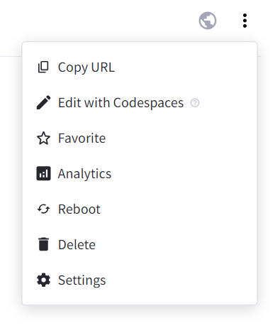
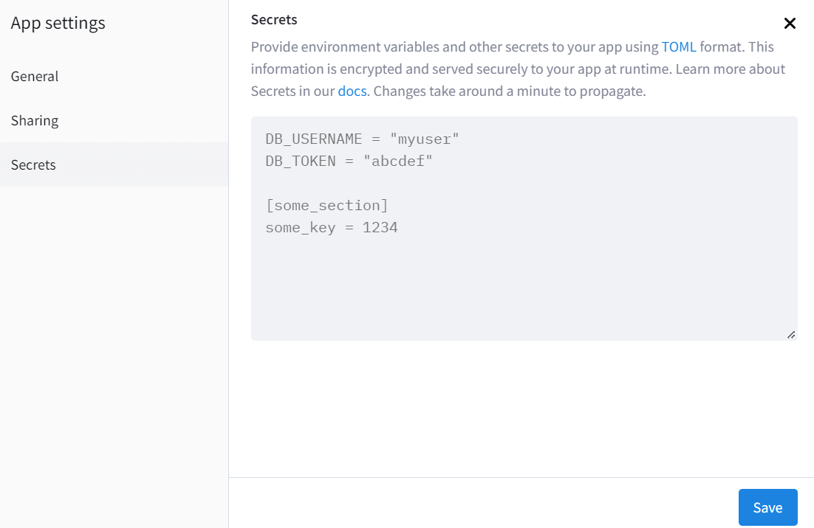

# Streamlit app with user authentication and Supabase database connection

(Assessment tool for my students in Fundamental of Programming Lab.)

The application must have the following features:
- allow for user authentication; the user credentials must be stored securely in a database
- once logged-in the student must access it's grades and attendance report at every lab
- the  student must be able to log-out (have a log-out button)

The database service of my choice is supabase.\
The programming language is pyhton.\
The web hosting is the official streamlit service, where the app will be deployed.\

## 1. Connecting to the supabase database and accessing the tables
In order to connect to the database where all the data is stored, one must import the supabase package.
```
from supabase import create_client

# Initialize the connection
def init_connection():
    url = "secret_url_provided_when_creating_the_db"
    key = "secret_key_provided_when_creating_the_db"
    return create_client(url, key)
supabase = init_connection()
```
When deploying the app, this information must be secured in the app's Settings -> Secrets under "supabase_url" and "supabase_key".\
 

Once the connection was initialized, we have access to the tables in the database. This particular database contains two tables, <i>credentials</i> stores the user information and <i>fplab</i> stores the student grades and attendance.

```
# Fetch the user information needed for the authentication
def run_user_query():
    return supabase.table("credentials").select("*").execute()
credentials_rows = run_user_query()
```
## 2. User authentication
For the user authentication service, I'll use the one from streamlit. It requires that the credentials are provided in a dictionary with the following format:
```
config = {
    "credentials": {
        "usernames": {
            "user1":{"name":"Mary", "password":"hashed-pwd1"},
            "user2":{"name":"Tomi", "password":"hashed-pwd2"},
            "user3":{"name":"Anna", "password":"hashed-pwd3"}
            }
            }
        }
```
Once the user data is formated as requested by streamlit authenticator, we are ready to login:

```
authenticator = stauth.Authenticate(credentials = config["credentials"],
                                    cookie_name = "blabla", 
                                    key = "xx", # cookie_key
                                    cookie_expiry_days=0)
name, authentication_status, username = authenticator.login("Login", "main")
```
The authentication status can be None, when no password/ username is introduced, False when any of the the password/ username is incorrect, or True (which is what we want) if the login was successful.\
If the login was successful, then we proceed with accessing the student's information.

## 3. Accessing the student information from the database
The student information is in the same database as the user data, but in another table. Therefore, as we already initialized the connection to the database, the only steps left are: querying the corresponding table based on the user id, storing the student information in a pandas dataframe and build the dashboard accessible by the student.

## 4. Adding a log-out button
Is as easy as adding the command below anywhere after the successful login. 
```
authenticator.logout("Logout", "sidebar")
```
